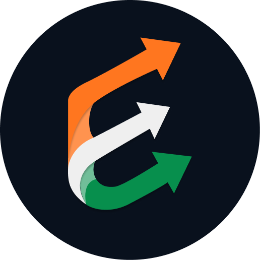

# ExamEdger - Elevate Your Prep

  
  <h1>ExamEdger IN</h1>
  

    <strong>The ultimate companion for Indian Competitive Exams.</strong>
  

  

    <a href="#features">Features</a> •
    <a href="#tech-stack">Tech Stack</a> •
    <a href="#getting-started">Getting Started</a>
  

---

## 🚀 Overview

**ExamEdger** is a comprehensive exam preparation platform designed to streamline the journey of aspirants targeting major Indian competitive exams (JEE, NEET, UPSC, SSC, etc.). It combines accurate exam data, preparation tools, and community wisdom into a premium, modern interface.

Preparing for 2026? We've got you covered with updated schedules, notifications, and official quick links.

## ✨ Key Features

### 📚 Extensive Exam Directory
*   **Detailed Dossiers**: Complete information on 50+ exams including Eligibility, Pattern, Syllabus, and Important Dates.
*   **2026 Ready**: Up-to-date schedules for the upcoming exam season.
*   **News & Updates**: Real-time notifications about admit cards, results, and official announcements.
*   **Preparation Roadmaps**: Curated guides, topper strategies, and syllabus breakdowns.
*   **Official Quick Links**: One-click access to official notifications, brochures, and registration portals.

### 🛠️ Smart Utility Tools
*   **Photo Studio**: Resize and format your passport photos to meet specific exam requirements (e.g., 3.5cm x 4.5cm, <50kb).
*   **Date Stamper**: Automatically add the date of photograph as required by many exam boards.
*   **PDF Toolkit**: Compress marksheets and documents to meet upload limits without losing quality.

### 📊 Personalized Dashboard
*   **Progress Tracking**: Monitor your study hours, mock test scores, and accuracy.
*   **Exam Timeline**: Visual countdowns to your targeted exams.
*   **Daily Briefing**: Quick 5-minute current affairs updates.

### 🎨 Modern & Responsive Design
*   **Dark/Light Mode**: Seamless theme switching for comfortable reading at any time.
*   **Premium UI**: Built with a focus on aesthetics, using glassmorphism, smooth animations, and the 'Space Grotesk' & 'Iceland' typography.

## 💻 Tech Stack

*   **Frontend**: [React](https://react.dev/) (v19) with [Vite](https://vitejs.dev/)
*   **Styling**: [Tailwind CSS](https://tailwindcss.com/)
*   **Animations**: [Framer Motion](https://www.framer.com/motion/)
*   **Icons**: [Lucide React](https://lucide.dev/)
*   **Language**: [TypeScript](https://www.typescriptlang.org/)

## 📄 License

This project is licensed under the MIT License.

---

  Built with ❤️ for Indian Aspirants.

